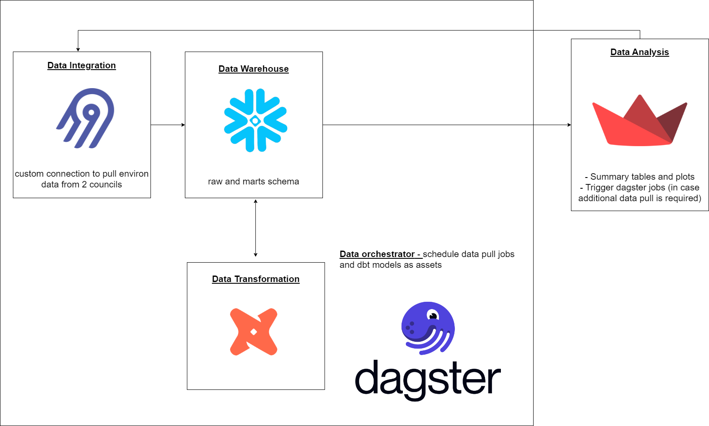

# project-2-bootcamp

## Objective of the project

This data engineering project involves in using Dagster to orchestrate a batch ELT solution to pull environmental data from 2 NZ regional councils, parsing the XML responses with a python based pipeline, updating a Database in Snowflake with new records, using DBT to prepare the tables to be used by consumers and then visualizing the results in a Streamlit app.

The objective of this project is to is to provide an analytical instruments to presents lake health information accross NZ. Councils all around NZ collect a series of environmental data as part of their environmental programms and the following measurements are used to help identify the quality of the aquatic life in lakes:

- Chlorophyll a – a measure of phytoplankton (algae) growth that impacts ecological communities and water clarity 

- Total phosphorus and total nitrogen – nutrients that can lead to elevated plant and algae growth

- Ammonia toxicity – a nutrient that can be toxic to aquatic life 

This data is usually collected once a month at different dates and schedules across councils. This project will access the data servers of councils every hour to look for new data records. A Dagster job will handle the incremental updated to the RAW schema in Snowflake. DBT assets will be used to summarise the dataset and generate fact and dimension tables as well as a big table to be used in a streamlit project.

The final product will allow users to select the start and end time that plots should be based on and inform when was the last day that data was collected for all three sites.

## Consumers of your data (What users would find your dataset useful?)

Data scientists and general public that need information about the data collected in situ.

## Datasets your team have selected

- Historical dataset: extracted from an internal DB and wrangled to meet the data structure returned from the API calls.
  
- Council's API endpoints


## Solution architecture



- Airbyte (build custom connection to a private API):
  - schedule new API requests every 1h
  - save raw JSON to the DW DB in Snowflake inside the RAW schema (append as the attributes return arrays - we can not use the deduped strategy in this case as the response needs to be parsed) 
- Snowflake
  - RAW: 12 tables, one for each site (2) and endpoint (3) plus 6 to each historical dataset (connected to Airbytes)
  - RAW_STAGING: latest parsed API response
  - RAW_SILVER: the full datasets for each site + data type, which includes the historical dataset and the incremental loads
  - RAW_MARTS: 1 fact table (records) and two dimensions (wind, temperature, summary table (min, max, mean, last_update)), a periodic snapshot table (per month, including number of records) and a big table.  
- Streamlit: present results

## Breakdown of tasks:
- Create connection with the 
- Schedule dagster jobs to run every 60 min
- Create dbt project
- Save and process historical records and add the final results as csvs in the seed/ folder
- Parse latest API responses
- Use time as incremental column to generate the complete datasets for each environmental data + site monitored in the silver schema
- Use data modelling concepts to generate dim and fact tables
- Deploy the ELT pipeline orchestrated by dagster in the cloud
- Create a streamlit project to showcase the data and deploy it to the cloud using a CI/CD pipeline 


## Steps to build a dbt project

- create a .venv with 
- activate it:
- run `dbt init` and add all information required
- create a profiles.yml inside the folder (check data_transformation/profiles.yml file)
- go to your terminal and specify your env variables:

`export SNOWFLAKE_USER=...`
`export SNOWFLAKE_PASSWORD=...`

- create a packages.yml file (check data_transformation/packages.yml) and run `dbt deps`
- run `dbt run`

## Tests

## Docker - dbt:

`docker build . -t warehouse-dbt:2.0`

`docker run -it warehouse-dbt:2.0`

`docker tag warehouse-dbt:2.0 905418180964.dkr.ecr.ap-southeast-2.amazonaws.com/dbt-warehouse-proj2:latest`

`docker push 905418180964.dkr.ecr.ap-southeast-2.amazonaws.com/dbt-warehouse-proj2:latest`


# project-3-bootcamp

<table>
    <tr>
        <th>Requirement</th>
        <th>Percentage of marks</th>
        <th>Plan</th>
    </tr>
    <tr>
        <td>
            [Batch | Streaming] Use either a static or live dataset.
            <li>A static dataset refers to a dataset that is not changing e.g. a CSV file.  </li>
            <li>A live dataset refers to a dataset that has data updating live (e.g. every second, every minute, every hour, every day).</li>
            <li>A live dataset can also refer to a dataset that you are able to generate mock data from, for example, a mock kafka producer or a database table.</li>
        </td>
        <td>
            <li>Static dataset: 5%</li>
            <li>Live dataset: 10%</li>
        </td>
        <td>
            <li>Live dataset:  LAWA (site table and env data)</li>
            <li>Live dataset: Temperature</li>
        </td>
    </tr>
    <tr>
        <td>
            [Batch] Using a data integration tool (e.g. Airbyte, Fivetran), extract data using either full extract or incremental extract.
            <li>A full extract refers to a full read of a file, a full read of a database table, or a full read from an API endpoint. </li>
            <li>An incremental extract refers to reading a database table with a filter condition on a timestamp column e.g. `where event_date > '2020-01-01'`.</li>
        </td>
        <td>
            <li>Full extract: 5%</li>
            <li>Incremental extract: 7.5%</li>
            <li>(Bonus) Change Data Capture (CDC): 10%</li>
        </td>
    </tr>
    <tr>
        <td>
            [Streaming] Streaming data integration. Produce events to a kafka topic.
            <li>Create or use an existing mock Kafka producer to write to a kafka topic. </li>
            <li>Create a custom kafka consumer, or use an existing kafka connector to consume from a kafka topic. </li>
        </td>
        <td>
            <li>Kafka producer and Kafka consumer (you may use Kafka Connect for both): 10%</li>
        </td>
    </tr>
    <tr>
        <td>
            [Batch | Streaming] Transform data in batch or real-time using either a Data Warehouse technology (e.g. Databricks Spark, Snowflake, BigQuery, Redshift, Synapse) or a Streaming technology (e.g. kSQLDB, Clickhouse). Transformations should use the following techniques:
            <li>Aggregation function e.g. `avg`, `sum`, `max`, `min`, `count`, `rank`</li>
            <li>Grouping i.e. `group by`</li>
            <li>Window function e.g. `partition by`</li>
            <li>Calculation e.g. `column_A + column_B`</li>
            <li>Data type casting</li>
            <li>Filtering e.g. `where`, `having`</li>
            <li>Sorting</li>
            <li>Joins/merges</li>
            <li>Unions</li>
            <li>Renaming e.g. `select col_a as my_col_a` </li>
        </td>
        <td>
            <li>3 transformation techniques: 5%</li>
            <li>5 transformation techniques: 7%</li>
            <li>7 transformation techniques: 10%</li>
        </td>
    </tr>
    <tr>
        <td>
            [Streaming] Perform streaming transformations such as:
            <li>Joins with matching timeframes i.e. `WITHIN`</li>
            <li>Aggregations with time windows i.e. tumbling, hopping, session windows</li>
        </td>
        <td>
            <li>Streaming transformations: 5%</li>
        </td>
    </tr>
    <tr>
        <td>
            [Batch] Data modeling techniques (e.g. dimensional modeling, one big table, etc):
            <li>At least 1 fact table</li>
            <li>At least 3 dimension tables</li>
            <li>(Bonus) Type 2 Slowly changing dimension (SCD)</li>
            <li>(Bonus) Advanced fact tables</li>
        </td>
        <td>
            <li>At least 1 fact table, and 3 dimensional tables: 5%</li>
            <li>+ (Bonus) Type 2 Slowly changing dimension (SCD Type 2): 7.5%</li>
            <li>+ (Bonus) Advanced fact tables (snapshot or accumulating fact table): 10%</li>
        </td>
    </tr>
    <tr>
        <td>
            [Batch | Streaming] Write data quality tests for transformation tasks (e.g. dbt tests, great expectations, soda sql). For streaming (e.g. clickhouse) you may use <a href="https://clickhouse.com/docs/en/integrations/dbt/dbt-intro">dbt</a> to create views and perform data quality tests on the views.
        </td>
        <td>
            <li>2 data quality tests: 5% </li>
            <li>5 data quality tests: 10% </li>
        </td>
    </tr>
    <tr>
        <td>
            [Batch] Create dependencies between data integration and data transformation tasks. Schedule and monitor tasks using a data orchestration tool (e.g. Dagster, Airflow, Databricks Workflow).
        </td>
        <td>
            <li>Dependencies between data integration and data transformation tasks: 10%</li>
        </td>
    </tr>
    <tr>
        <td>
            [Batch | Streaming] Create a data application that generates insights or predictions for end-users (e.g. a Preset dashboard, a real-time ML application):
        </td>
        <td>
            <li>Semantic Layer and Dashboard, or ML model inference, or other data apps (please discuss with an instructor): 10%</li>
        </td>
    </tr>
    <tr>
        <td>
            [Batch | Streaming] Deploy solution to Cloud services. Please provide screenshot evidence of services configured/running where possible. Examples of cloud services:
            <li>Data integration service (e.g. Airbyte, Fivetran) - screenshot of configured tasks</li>
            <li>Data transformation services (e.g. dbt sql, databricks notebook)</li>
            <li>Data Warehouse (e.g. Snowflake) or Data Lakehouse (e.g. Databricks) depending on your choice</li>
            <li>Data orchestration service (e.g. Dagster, Databricks Workflows)</li>
            <li>Kafka producer hosted on a cloud service (e.g. ECS service)</li>
            <li>Kafka broker hosted on a cloud service (e.g. Confluent Cloud)</li>
            <li>kSQLDB transformation hosted on a cloud service (e.g. Confluent Cloud)</li>
            <li>Kafka connect or consumer hosted on a cloud service (e.g. Confluent Cloud)</li>
            <li>Real-time database hosted on a cloud service (e.g. Clickhouse cloud)</li>
        </td>
        <td>
            Entire solution hosted on cloud services: 10%
        </td>
    </tr>
    <tr>
        <td>
            [Batch | Streaming] Using git for collaboration:
            <li>Git commits and git push</li>
            <li>Git branching</li>
            <li>Pull request and review</li>
        </td>
        <td>
            <li>Git commits and push only: 2.5%</li>
            <li>+ Git branching: 4%</li>
            <li>+ Pull request and review: 5%</li>
        </td>
    </tr>
    <tr>
        <td>
            [Batch | Streaming] Create CI and/or CD pipelines to:
            <li>CI - build and test code when a pull request is triggered</li>
            <li>CD - build and deploy code to a target environment (e.g. preprod, and prod)</li>
        </td>
        <td>
            <li>CI pipeline with build and tests: 5%</li>
            <li>+ CD pipeline with deployment of application code to target environment: 10%</li>
        </td>
    </tr>
    <tr>
        <td>
            [Batch | Streaming] Project structure and documentation
            <li>Clear project structure using a mono-repo approach with folders such as `data transformation`, `data integration`, `data orchestration` for the various components</li>
            <li>Code documentation using <a href="https://realpython.com/documenting-python-code/#documenting-your-python-code-base-using-docstrings">Python docstrings and comments</a> or SQL comments where reasonable</li>
            <li>README file at the root of the repository explaining the project context, architecture and installation/running instructions. See <a href="https://github.com/matiassingers/awesome-readme">here</a> for examples.</li>
        </td>
        <td>
            <li>Clear project structure: 2.5%</li>
            <li>Code documentation using Python or SQL comments where reasonable: 2.5%</li>
            <li>Detailed markdown documentation explaining the project context, architecture and installation/running instructions: 5%</li>
        </td>
    </tr>
</table>


## DAGSTER

# Instruction

## Step-by-step

### Step 1: Create new virtual environment

Create a new environment

```
py -3.11 -m venv .venv
source .venv/Scripts/activate
```

### Step 2: Install dagster

```
pip install dagster==1.6.8
```

### Step 3: Bootstrap a new project

Scaffold new dagster project ([taken from here](https://docs.dagster.io/getting-started/create-new-project#step-1-bootstrap-a-new-project)).

```
cd unsolved
dagster project scaffold --name analytics
```

Rename top level `analytics` folder to `dagster` to avoid confusion.


The following structure has been scaffolded for you

```
dagster/
|__ analytics/
    |__ __init__.py
```

The root `analytics/__init__.py` file contains a [Definitions](https://docs.dagster.io/concepts/code-locations#defining-code-locations) object which defines all the code logic of this project.

### Step 4: Run dagster

Install other dependencies required for this dagster project

```
cd dagster
pip install -e ".[dev]"
```

Run dagster

```
dagster dev
```

Open dagster web UI in your browser: http://127.0.0.1:3000


### Step 5: Create ops

Create new folder and files

```
dagster/
|__ analytics/
    |__ __init__.py
    |__ ops/            # create new folder
        |__ __init__.py     # create new file
        |__ weather.py      # create new file
```

In `analytics/ops/weather.py`, create ops that replicate's functions from the following code: `01-python-etl/3/11-ins-scheduling/solved/etl_project/assets/weather.py`.

For examples on how to create ops, see: https://docs.dagster.io/concepts/ops-jobs-graphs/ops

Make sure to use op config to expose configurations to the user of dagster: https://docs.dagster.io/concepts/configuration/config-schema#using-ops

Use `EnvVar('secret_name')` to fetch environment variables: https://docs.dagster.io/guides/dagster/using-environment-variables-and-secrets#from-dagster-configuration

Use [Resources](https://docs.dagster.io/concepts/resources) to make connection string details and secrets reusable by other ops and jobs.


### Step 6: Create jobs

After creating ops, stitch together the ops using a job.

Create the following folder and files

```
dagster/
|__ analytics/
    |__ __init__.py
    |__ ops/
        |__ __init__.py
        |__ weather.py
    |__ jobs/               # create new folder
        |__ __init__.py     # create new file
```

In `analytics/jobs/__init__.py`, import the previously created ops and create a job.

For more details on how to create a job, see: https://docs.dagster.io/concepts/ops-jobs-graphs/op-jobs

### Step 7: Add jobs and resources to Defintions object

```python
from dagster import Definitions, EnvVar

from analytics.jobs import run_weather_etl
from analytics.resources import PostgresqlDatabaseResource

defs = Definitions(
    jobs=[run_weather_etl],
    resources={
        "postgres_conn": PostgresqlDatabaseResource(
            host_name=EnvVar("postgres_host_name"),
            database_name=EnvVar("postgres_database_name"),
            username=EnvVar("postgres_username"),
            password=EnvVar("postgres_password"),
            port=EnvVar("postgres_port")
        )
    }
)
```

### Step 8: Manually trigger job

In the dagster UI, go to "Overview" > "Jobs".


Select the `run_weather_etl` job.


Scaffold the missing and default config. You shouldn't need to replace them.

Click on "Launch Run".
